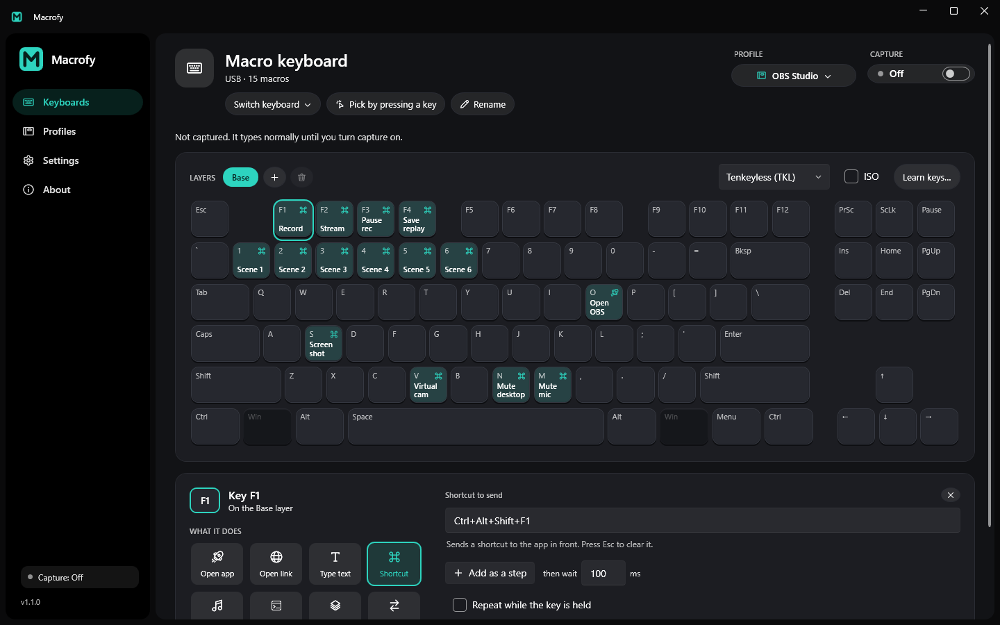

# Macrofy

Macrofy is a free Windows app that turns a spare keyboard into a macro pad. Plug in a second keyboard, tell Macrofy to capture it, and its keys stop typing and start running macros instead: open an app, type a snippet, send a shortcut, skip a song. The keyboard you actually type on keeps working like normal.

Think Stream Deck, except it's a whole keyboard, you probably already own one, and it costs nothing.



**[Download Macrofy-win-Setup.exe](https://github.com/UltimaCodes/Macrofy/releases/latest/download/Macrofy-win-Setup.exe)** for Windows 10 and 11. Latest version: 1.2.0 ([what's new](release-notes/1.2.0.md)).

## Quick facts

| | |
|---|---|
| Price | Free. Every macro feature, no trial, no account |
| Works on | Windows 10 and 11, 64-bit |
| Driver | None. Nothing gets installed into the Windows kernel |
| Goes online | Only to check GitHub for updates, and you can turn that off |
| Source | Open source, MIT licence |

## What can Macrofy do?

- Capture one keyboard. Its keys run macros, and every other keyboard keeps typing.
- Eight kinds of action: open an app or file, open a link (app links like `spotify:` and `whatsapp://` work too), type text, send a shortcut, control media and volume, run a command, hold a layer, or switch layers.
- Multi-step macros with a wait between steps, like Ctrl+K, wait 60 ms, then S.
- Repeat while held, for keys like volume, zoom and undo that should keep going.
- Layers. Hold or tap a key to flip the whole keyboard to another set of macros, like an Fn key you design yourself.
- Profiles. Save a set of macros and put it on any keyboard. Import and export them as files to move them to another PC or send them to a friend.
- Templates for OBS Studio, Photoshop and VS Code, so you can start with a working setup and change it from there.
- An on-screen keyboard that shows what every key does. Full size, TKL, 75%, 65%, 60% and numpad layouts, ANSI or ISO, and a Learn keys mode for odd boards.
- It lives in the tray. It can start with Windows, capture your macro keyboard at startup, and toggle capture with a shortcut you turn on in Settings (Ctrl + Alt + F10 unless you pick another).

## How do I set it up?

1. Download and run `Macrofy-win-Setup.exe`.
2. On the Keyboards page, click **Pick by pressing a key** and tap any key on your spare keyboard.
3. Turn on **Capture**. That keyboard stops typing now.
4. Click a key on the on-screen keyboard, pick what it should do, and click **Save macro**. Or skip the setup: open Profiles and click **Use this template** on OBS Studio, Photoshop or VS Code.

Turn capture off any time to give the keyboard back to Windows. To have it always on, go to Settings and turn on **Start with Windows** and **Capture a keyboard at startup**. Macrofy will then grab your macro keyboard every time you sign in, and again whenever it's plugged back in.

## Installing, updating and uninstalling

The installer is about 12 MB. It installs Macrofy for your user account only, so there's no admin prompt, and adds Start menu and desktop shortcuts. If your PC doesn't have the .NET 8 Desktop Runtime yet, the installer gets it first.

When a new version is out, Macrofy tells you when it starts, and you install it from Settings in one click.

If you'd rather not install anything, grab `Macrofy-win-Portable.zip` from the [latest release](https://github.com/UltimaCodes/Macrofy/releases/latest), unzip it anywhere and run `Macrofy.exe`. The portable version needs the [.NET 8 Desktop Runtime](https://dotnet.microsoft.com/download/dotnet/8.0) installed.

Macrofy isn't code-signed yet, so the first time you run it Windows may show a blue "Windows protected your PC" box. That's about the missing signature, not anything in the app. Click **More info**, then **Run anyway**.

To uninstall, remove Macrofy from Windows Settings > Apps like any other app. Your profiles stay in `%AppData%\Macrofy` in case you come back. Delete that folder to get rid of them too.

## Is Macrofy free?

Yes. Every macro feature is free and stays free. A paid add-on with an AI assistant you can put on a key is planned for later. It adds new things on top and won't take anything away from the free app.

## How is it different from a Stream Deck or AutoHotkey?

A **Stream Deck** is dedicated hardware with little screens on the keys. Elgato's list prices in October 2026 were $59.99 for the 6-key Stream Deck Mini and $149.99 for the 15-key Stream Deck. Macrofy uses a keyboard you already have, so you get around a hundred real keys for free. You don't get screens on the keys, but the app shows what each one does.

**AutoHotkey** is great for scripting, but on its own it can't tell two keyboards apart, so a hotkey fires no matter which keyboard you press it on. Getting per-keyboard hotkeys out of it usually means adding a separate input driver. Macrofy does one keyboard at a time out of the box, and you set keys up by clicking, not by writing code.

**Phone and tablet deck apps** give you touchscreen buttons. Macrofy gives you real keys you can hit without looking.

## How does Macrofy tell keyboards apart?

The hard part is blocking input from one specific keyboard, because the two Windows features you'd reach for don't combine the way you'd want.

**Raw Input** tells you which physical keyboard a key came from, but it can't block anything.

**A low-level keyboard hook (`WH_KEYBOARD_LL`)** can block keys, but it has no idea which device a key came from, and it runs before Raw Input. Worse, once it blocks a key, Windows never generates that key's Raw Input at all, so blocking a key destroys the only clue about which keyboard sent it. Macrofy tried this first. It's a dead end.

So Macrofy blocks later, with a regular **`WH_KEYBOARD`** hook. That one runs when an app picks up the keyboard message, which is after Raw Input has already worked out which device it came from. The hook has to live in a DLL that Windows loads into other apps, so Macrofy ships a tiny one (`native/hook.c`, built into `MacrofyHook.dll`):

1. The DLL installs the hook, and for each key it asks Macrofy's hidden decider window whether to block it.
2. Macrofy also listens to Raw Input, so by the time the hook asks, it already knows which keyboard sent the key. It says block for the captured keyboard and pass for everything else. Nothing gets re-sent, so your other keyboards are never touched.

The hook is only installed while a keyboard is captured, and it's removed when you turn capture off or close Macrofy.

### Why not use a driver?

A kernel driver could block keys more completely, but it's a much bigger thing to install and to trust, and anti-cheat systems are wary of input drivers. Macrofy stays driver-free on purpose, which is also why it has the limits below.

## Does Macrofy work in games?

Macros fire in most games. Plenty of games, fullscreen ones especially, read the keyboard directly instead of through normal Windows messages, though. Those games also see the key from the captured keyboard, and in some it looks like nothing is captured at all. There's no driver-free way around that.

Games with kernel-level anti-cheat (Vanguard, EAC, BattlEye) watch for tools that load into other programs, and Macrofy's hook DLL does exactly that. Use it in those games at your own risk.

## What doesn't work?

These come with the driver-free approach, plus one known bug:

- **Admin mode types the key first.** With Macrofy running as administrator, the captured key also types in normal apps before the macro runs, so a key set to type "hello" gives you "xhello". Leave **Always run as administrator** off unless you need macros inside an app that itself runs as admin.
- **Admin apps need admin Macrofy.** Capture doesn't work inside apps running as administrator unless Macrofy runs as administrator too. Settings has a button to restart it that way.
- **The Windows keys can't be macros.** Windows handles them before any app sees them, so they're dimmed in the app.
- **Some Microsoft Store apps aren't covered.** Apps like Calculator don't load the hook, so the captured keyboard types normally while one is in focus.
- **Virtual keyboards don't work.** Remote desktop sessions and virtual machines can be janky, so use a physical keyboard on a real PC.

## Is Macrofy a keylogger?

No. To tell your keyboards apart, Macrofy looks at which keyboard each key press comes from, so it can block the captured one and run your macro. It doesn't record what you type, doesn't keep anything about your typing, and doesn't send anything anywhere. The only time it goes online is to check GitHub for a new version. The code is all here, so you can check for yourself.

## Where are my macros saved?

Everything is in `%AppData%\Macrofy` on your PC: your profiles (`library\`), which keyboard uses which profile, keyboard names, layouts, settings, and a `log.txt` if anything ever crashes. Settings has an Open folder button. To move your setup to another PC, export your profiles from the Profiles page and import them there.

## Building from source

You need Windows and the [.NET 8 SDK](https://dotnet.microsoft.com/download/dotnet/8.0).

```
dotnet build Macrofy.sln
dotnet test src/Macrofy.Tests
```

What's where:

- `src/Macrofy.App` is the app itself (WPF), including the tray, settings and updates.
- `src/Macrofy.Core` is the capture engine, macros and profiles.
- `src/Macrofy.Diag` is a console tool that lists keyboards and shows what capture is doing, for debugging.
- `src/Macrofy.Tests` has the unit tests.
- `native/` is the hook DLL. A prebuilt `MacrofyHook.dll` is committed. To rebuild it, install MinGW gcc (`winget install BrechtSanders.WinLibs.POSIX.UCRT`) and run `native/build.ps1`.
- `website/` is the Macrofy website (see its own README).
- `release-notes/` has the notes for each version.

## Releasing

1. Write the notes in `release-notes/<version>.md`.
2. Bump `<Version>` in `src/Macrofy.App/Macrofy.App.csproj`.
3. Push a tag:

```
git tag v1.2.0
git push origin v1.2.0
```

GitHub Actions runs the tests, builds the installer with [Velopack](https://velopack.io), and publishes a release with `Macrofy-win-Setup.exe`, the portable zip, the update files installed copies look for, and your release notes.

To build the installer on your own PC instead, run `dotnet tool install -g vpk` once, then `.\publish.ps1`. The output goes in `dist\`.

## License

MIT. See [LICENSE](LICENSE).
